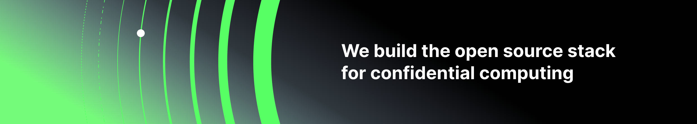

    <b>⭐ Star us on GitHub — it motivates us a lot!</b>

<h1 align="center">👋 Hi there, we're Edgeless Systems 👋</h1>

<b>Our mission is to make confidential computing accessible and scalable for everyone.</b>

## 🏢 About us

As a cyber-security startup based in Germany, we are developing leading open source solutions to make confidential computing accessible and scalable.

With our projects and active GitHub followers and contributors, we are providing provable security against unauthorized data access (e.g., hackers/ransomware, system admins, governments) and enable the processing of sensible data in the cloud without having to trust the cloud provider.

### What is confidential computing?

Confidential computing is a new security paradigm that raises data protection to unprecedented levels. By keeping data always encrypted and making all workloads verifiable, confidential computing enables provable security, even on public clouds.

Find out more about confidential computing on our [website](https://www.edgeless.systems/resources/confidential-computing/).

## 📦 Our main projects

- [✨ Constellation](https://github.com/edgelesssys/constellation): The world's first Confidential Kubernetes
- [💾 EdgelessDB](https://github.com/edgelesssys/edgelessdb): The most secure database out there
- [🏃 MarbleRun](https://github.com/edgelesssys/marblerun): The control plane for confidential computing
- [😎 EGo](https://github.com/edgelesssys/ego): The SDK for building confidential apps in Go

    

         
        &nbsp;&nbsp;&nbsp;&nbsp;&nbsp;&nbsp;&nbsp;&nbsp;&nbsp;&nbsp;
         
        &nbsp;&nbsp;&nbsp;&nbsp;&nbsp;&nbsp;&nbsp;&nbsp;&nbsp;&nbsp;
        
        &nbsp;&nbsp;&nbsp;&nbsp;&nbsp;&nbsp;&nbsp;&nbsp;&nbsp;&nbsp;
        
    

<!--
| Projet | Purpose | Repo |
| :---: | :---: | :---: |
|  | The world's first Confidential Kubernetes | ![ego_card][ego_card] |
|  | The most secure database out there | ![edgelessdb_repo][edgelessdb_repo] |
|  | The control plane for confidential computing | ![marblerun_repo][marblerun_repo] |
|  | The SDK for building confidential apps in Go | ![ego_repo][ego_card] |

[ego_repo]: https://github.com/edgelesssys/ego
[ego_card]: https://github-readme-stats.vercel.app/api/pin/?username=edgelesssys&repo=ego&theme=dark
[marblerun_repo]: https://github-readme-stats.vercel.app/api/pin/?username=edgelesssys&repo=marblerun&theme=dark
[marblerun_card]: https://github-readme-stats.vercel.app/api/pin/?username=edgelesssys&repo=marblerun&theme=dark
[edgelessdb_repo]: https://github-readme-stats.vercel.app/api/pin/?username=edgelesssys&repo=edgelessdb&theme=dark
[edgelessdb_card]: https://github-readme-stats.vercel.app/api/pin/?username=edgelesssys&repo=edgelessdb&theme=dark
-->

    <a href="https://goo.gl/maps/VF9qjVtjzE8KT9jz6">2022, Bochum, Germany</a>

